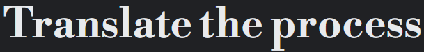
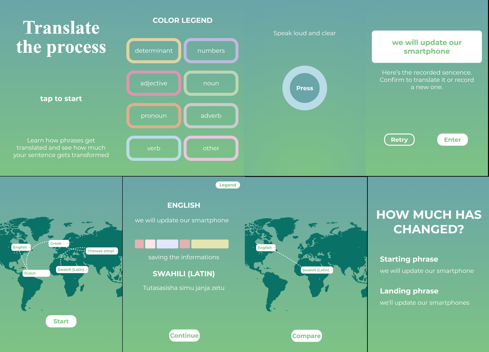

## 1. [PROJECT IDEA](#project-idea)

### a. Theme

### b. Aim

### c. Concept

### d. Context of use

## 2. [STRUCTURE](#structure)

## 3. [CODE](#code)

### a. Translator API

### b. Speech recognition

### c. Syntax analysis

### d. Animations

## 4. [TEAM](#team)



# PROJECT IDEA

**THEME**

The project is inspired by the world of neural machine translators, such as the well known Google Translate. The system they are built upon is an interesting look at how we value languages, and how dipendent we can be from English as a lingua franca; this of course could lead to some mistake (in most contexts hilarious), mitigated by the neural network system that predicts the likelihood of the sequence of words, typically modeling entire sentences in a single integrated model.
An important step for the comprehension of the theme is the translation of the phrase into a vector, that allows the algorythm to "navigate" between languages.

**AIM**

The goal of the project is to make people connect with this system that we take for granted, comprehending dynamics too often overlooked. In addition we just wanted to create a pleasant experience, entertaining for the naturally funny ways phrases can be distorted when "traveling" metaphorically through continents and literally through languages.

**CONCEPT**

The project is designed for a single user; they will need to press the big button on the screen to start recording their phrase (in English), inputted through voice recognition. After that, an animation will represent the transformation of the phrase into vector, taking account of all the different parts of it. Then a map of the globe will be shown, and the user will be able to choose a language for every continent of the world; the original phrase will be then translate in every language chosen, in the set order. This will be shown with an animation composed of text and arrows.
As the last step, the user will be able to observe its phrase get back to them, translated again in English, seeing it besides the orginal, and look at the way it will be slightly or majorly different.

**CONTEXT OF USE**

Our project has been designed as an installation/exhibit; the installation is held in a closed room where the entrance is suggested to one single person at a time, even if more can access as long as they dont cause noise, that will need to position themselves in front of a tablet. This is the case because our voice recognition library has shown itself to misbehave if near sources of noise.
The device will need to have touch functionalities and a microphone of course, being touch and speech the only ways to communicate with the project.

# STRUCTURE




Here is a scheme of the project and its concept rendition.

The project is composed of a single HTML page, in which the various parts are set to go off based on timers and the interaction of the user with a button and some drop-down menus.

1. The introduction page invites the user to press the big button on the screen;
2. Then the user will be able to talk, spelling the sentence to be translated in english;
3. The phrase will be then translated into a language for every continent, chosen from a selected pool, in the set order;
4. After the last translation, the phrase will be translated again in English, to be confronted with the starting one;

# CODE

**TRANSLATOR API**

We implemented [Azure translator API](https://azure.microsoft.com/it-it/products/cognitive-services/translator) for the process of translating our main phrase.

The implementation is rather short but complicated

```JavaScript
const translate_api_endpoint = "https://api.cognitive.microsofttranslator.com";
let translate_api_key = "fabd1ff9c0e94348ab8e9dcbb0c28444";
const translate_version      = "3.0";
const translate_region       = "switzerlandnorth";

let sentence = "Phrase we need to translate";

async function microsoft_translate(source_text, source_language, target_language) { //using an asyncronous function, that will request the data and wait for it to be sent back, without stopping the code from running
  const endpoint = `${translate_api_endpoint}/translate?api-version=${translate_version}&from=${source_language}&to=${target_language}`; // Constructing the URL to send to
  const data_body = [{'text': source_text}]; // Constructing the data to be sent
  const response = await fetch(endpoint, {
    method: 'POST', // We will use POST to send this data to the end point
    mode: 'cors', // CORS is a security feature that only allows requests to/from the same site, in this case because we're sending data to an external site we will turn it off
    cache: 'no-cache', // We will disable caching so that we will always get the "fresh" response from the server
    headers: {
      'Content-Type': 'application/json',
      'Ocp-Apim-Subscription-Key': translate_api_key,
      'Ocp-Apim-Subscription-Region': translate_region
    },
    body: JSON.stringify(data_body)
  });
  return response.json(); // parse json response into a javascript object and return
}
```

The process of translating works like this

```JavaScript
microsoft_translate(sentence, starting_lang, lang_to_translate_to).then((data) => {
    result = data[0]['translations'][0]['text'];
    console.log(result);
});
```

We couldnt name the function "translate()" using instead "microsoft_translate()" to avoid conflict with the preexisting p5js function.

**SPEECH RECOGNITION**

[p5 speech](https://idmnyu.github.io/p5.js-speech/) was implemented for speech recognition; the library has a lot of different functionalities, however we only needed that.

**SYNTAX ANALISIS**

To analize and recognize the elements of a phrase, we used [RiTa.js](https://github.com/dhowe/ritajs), a library that allows a great quantity of analysis on sentences.

We were mainly interested in the function

```JavaScript
let words = RiTa.pos(phrase);
```

This is how the two libraries work together

```JavaScript
  sketch.recording = function () {
    if (frame == 3 && control == false) {
      control = true;
      clicked = true;
      sketch.speechRec.start(); //The recording starts
    }
  };

  sketch.gotSpeech = function () { //Once it ends, we check the phrase's length and start the analysis
    if (sketch.speechRec.resultValue) {
      let said = sketch.speechRec.resultString;
      if (said.length <= 7) {
        phrase = said;
      } else {
        phrase = said.split(" ").splice(0, 7).join(" ");
      }
      analysis = RiTa.pos(phrase);
      clicked = false;
    }
  }
```

**ANIMATIONS**

For the world map animations we needed to keep track of the various selected languages and the order of the continents

```JavaScript

//This next array will contain all the languages (in order) written in a way that the Translation API can interpret


let langs = ["en", "en", "en", "en", "en"],
  shownTranslations = 1;

//Arrays containing every continent's selection menu coordinates (x and y), a boolean parameter to keep track of the
//lines already drawn and an int that will be used for the order


let csels = [75, 450, false];
let cselsa = [150, 625, false];
let cseleu = [325, 425, false];
let cselaf = [375, 600, false];
let cselas = [575, 475, false];

//Array that will keep track of the order in which the continents are visited


let route = ["sels"];

//Dictionary to keep track of the specific languages for every step of the route

let places = {
  0: "English",
  1: "English",
  2: "English",
  3: "English",
  4: "English",
};

//Dictionary to keep track of the specific languages for every step of the route

let current = [csels[0], csels[1]];
let next = [csels[0], csels[1]];

//Counter that will be needed to allocate every continent into their spot in the places dictionary

let order = 0;

var languageSketch = function (sketch) {
  let map;

  sketch.preload = function () {
//Preloading of the background image

    map = sketch.loadImage("assets/map.png");
  };

//Creating the select menu for North America (starting point, always English)


let sels = sketch.createSelect();
    sels.parent("map");
    sels.position(csels[0], csels[1]);
    sels.option("English");

//Creating the select menu for South America

    let selsa = sketch.createSelect();
    selsa.parent("map");
    selsa.position(cselsa[0], cselsa[1]);
    selsa.option("---"); //The options get added
    selsa.option("Spanish");
    selsa.option("Portuguese");
    selsa.option("French");
    selsa.option("Dutch");
    selsa.selected("---"); //The menu will display by default the null option

    selsa.changed(function () { //When the null option gets modified into any of the other options this happens
      next = [cselsa[0], cselsa[1]]; //The continent gets identified as the final point of the line

      if (cselsa[2] == false) { //If the line hasn't already been drawn this happens

        cselsa[2] = true; //This prevents the line from being drawn again towards this continent in the future

        sketch.append(route, "selsa"); //The continent gets added as the next step in our route

        cselsa[3] = order + 1; //The fouth element of the coordinates array is changed to the spot this continent has in the order of the route (+1 since english is always the first step)

        places[order + 1] = selsa.value(); //The dictionary that keeps track of the language at every step of the route is updated with the one selected

        sketch.mySelect(); //The line gets drawn by the mySelect function (it is separated from the arrow function for debugging purposes)

      } else if (csels[2] == false) { //If the line has already been drawn this happens

        places[cselsa[3]] = selsa.value(); //The dictionary is updated, without relying on the order counter, that could be already at 4

      }

      selsa.disable("---"); //The null option gets disabled to not cause confusion

    });

//Creating the select menu for Europe, Africa and Asia (seleu, selaf and selas) and of course the process is the same for every one of them

    [...]

//Creating the button used to confirm


    button = sketch.createButton("Start");
    button.id("start");
    button.parent("map");
    button.position(sketch.width / 2 - button.width / 2, sketch.height - 250);
    button.mousePressed(function () { //When pressed this happens

      if (order >= 4 && csels[2] == false) { //If the order reached its last number and the final line hasn't been drawn yet

        csels[2] = true; //We make sure the final line doesn't get drawn again

        nextFrame(); //We advance to the next screen

        sketch.confirm(); //The confirm function executes the final part of this section and sets up the second map segment
      }

//During the last part we hide all the menus but the first and the last

      if (csels[2] == true) {
        if (route[1] == "selsa" || route[2] == "selsa" || route[3] == "selsa") {
          selsa.hide();
        }

        if (route[1] == "seleu" || route[2] == "seleu" || route[3] == "seleu") {
          seleu.hide();
        }

        if (route[1] == "selaf" || route[2] == "selaf" || route[3] == "selaf") {
          selaf.hide();
        }

        if (route[1] == "selas" || route[2] == "selas" || route[3] == "selas") {
          selas.hide();
        }
      }
    });
  };
  sketch.draw = function () {};

  sketch.mySelect = function () { //If not all menus have been used yet we draw arrows

    if (order < 4) {
      sketch.arrow();
    }
  };

  sketch.arrow = function () {

//We increment the order counter, to prepare for the next step

    order++;

//We create a variable used to create the curve of the lines

    let curve = 50;
    if (order % 2 == 0) { //The curvature is alternated
      curve = -50;
    }

    sketch.push();

//We draw a Bezier curve, that will be our line

    sketch.noFill();
    sketch.strokeWeight(4);
    sketch.stroke(255, 255, 255);
    sketch.drawingContext.setLineDash([5, 10]);
    sketch.bezier(
      current[0] + 40,
      current[1] + 10,
      sketch.lerp(current[0], next[0], 0.25) + curve,
      sketch.lerp(current[1], next[1], 0.25) + curve,
      sketch.lerp(current[0], next[0], 0.75) + curve,
      sketch.lerp(current[1], next[1], 0.75) + curve,
      next[0] + 40,
      next[1] + 10
    );
    sketch.pop();

//We identify the last point of the curve as the new starting point

    current = [next[0], next[1]];
  };

  sketch.confirm = function () { //The last part of this section
    sketch.clear();
    sketch.background(map);

//We identify the first menu as our final point

    next = [csels[0], csels[1]];

//We draw a Bezier curve

[...]

//We then translate every language in the places dictionary into the form used by the Translation API

    for (let i = 1; i < 5; i++) {
      if (places[i] == "Spanish") {
        langs[i] = "es";
      } else if (places[i] == "Portuguese") {
        langs[i] = "pt";
      } else if (places[i] == "French") {
        langs[i] = "fr";
      } else if (places[i] == "Dutch") {
        langs[i] = "nl";
      } else if (places[i] == "Italian") {
        langs[i] = "it";
      } else if (places[i] == "German") {
        langs[i] = "de";
      } else if (places[i] == "Greek") {
        langs[i] = "el";
      } else if (places[i] == "Russian") {
        langs[i] = "ru";
      } else if (places[i] == "Arabic") {
        langs[i] = "ar";
      } else if (places[i] == "Afrikaans") {
        langs[i] = "af";
      } else if (places[i] == "Swahili (Latin)") {
        langs[i] = "sw";
      } else if (places[i] == "Chinese simpl") {
        langs[i] = "zh-Hans";
      } else if (places[i] == "Hindi") {
        langs[i] = "hi";
      } else if (places[i] == "Japanese") {
        langs[i] = "ja";
      } else if (places[i] == "Indonesian") {
        langs[i] = "id";
      } else if (places[i] == "Zulu") {
        langs[i] = "zu";
      }
    }
  }

```

To show the transformation of the original phrase into a vector, we applied a simple sliding animation, using some rectangles with rounded angles.
This next section is all in the draw() function.

```JavaScript

if (opacity <= 300) {
      for (let k = 0; k < shapes.length; k++) {

        shapes[k].create(); //We create an instance of the segment of the vector

      }
      opacity++; //It fades in

    } else if (h < 60) { //A timer that sets the segment to max opacity
      alpha = 255;
      for (let l = 0; l < shapes.length; l++) {
        shapes[l].create(); //The segments change color, according to Rita.js' analysis
      }
      h++; //"Timer"

      document.getElementById("analized").style.visibility = "hidden";
      document.getElementById("comments").innerHTML = "Adding a context to each word";

    } else if (opacity2 <= 300) { //A timer that sets the segment to max color
      colored = true;
      alpha = 5;

      setTimeout(function () {
        for (let n = 0; n < shapes.length; n++) {
          shapes[n].create(); //The segments increase in size, "absorbing" the words
        }
        opacity2++;
        if (opacity2 > 50 && opacity2 < 200) {
          alpha = 10;
        } else if (opacity2 > 200) {
          alpha = 5;
        }
        document.getElementById("comments").innerHTML = "Saving the informations";
      }, 2000);
      animationEnded = true;
    } else if (animationEnded == true) {
      sketch.showingTranslation(); //The translations in various langages get shown
      animationEnded = false;
    }

```

To give the selection menus and buttons a certain style, we implemented a [CSS file](./style.css).

# TEAM

Marta Piatti

Martina Previti

Zhang Huaije

Fatemeh Maher


**COURSE**

[Creative Coding 2021/2022](https://drawwithcode.github.io/2020/)

**Politecnico di Milano** - Scuola del Design

**Faculty:** Michele Mauri, Andrea Benedetti, Tommaso Elli.
