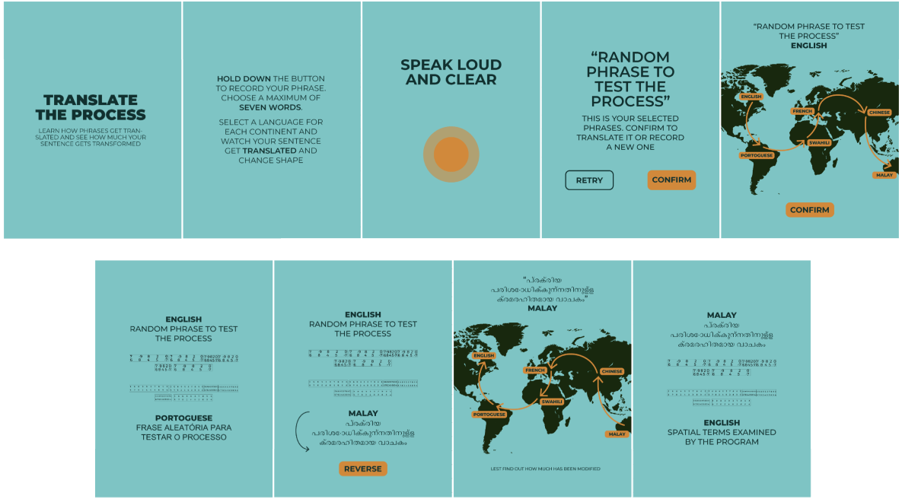

## 1. [PROJECT IDEA](#project-idea)

### a. Theme

### b. Aim / goal

### c. Concept

### d. Context of use

## 2. [STRUCTURE](#structure)

## 3. [CODE](#code)

### a. Speech recognition

### b. Translator API

### c. Syntax analysis

### d. Animations

## 4. [TEAM](#team)


# PROJECT IDEA

**THEME**

The project is inspired by the world of neural machine translators, such as the well known Google Translate. The system they are built upon is an interesting look at how we value languages, and how dipendent we can be from English as a lingua franca; this of course could lead to some mistake (in most contexts hilarious), mitigated by the neural network system that predicts the likelihood of the sequence of words, typically modeling entire sentences in a single integrated model.
An important step for the comprehension of the theme is the translation of the phrase into a vector, that allows the algorythm to "navigate" between languages.

**AIM**

The goal of the project is to make people connect with this system that we take for granted, comprehending dynamics too often overlooked. In addition we just wanted to create a pleasant experience, entertaining for the naturally funny ways phrases can be distorted when "traveling" metaphorically through continents and literally through languages.

**CONCEPT**

The project is designed for a single user; they will need to press the big button on the screen to start recording their phrase (in English), inputted through voice recognition. After that, an animation will represent the transformation of the phrase into vector, taking account of all the different parts of it. Then a map of the globe will be shown, and the user will be able to choose a language for every continent of the world; the original phrase will be then translate in every language chosen, in the set order. This will be shown with an animation composed of text and arrows.
As the last step, the user will be able to observe its phrase get back to them, translated again in English, seeing it besides the orginal, and look at the way it will be slightly or majorly different.

**CONTEXT OF USE**

Our project has been designed as an installation/exhibit; the installation is held in a closed room where the entrance is suggested to one single person at a time, even if more can access as long as they dont cause noise, that will need to position themselves in front of a tablet. This is the case because our voice recognition library has shown itself to misbehave if near sources of noise.
The device will need to have touch functionalities and a microphone of course, being touch and speech the only ways to communicate with the project.

# STRUCTURE



The project is composed of a single HTML page, in which the various parts are set to go off based on timers and the interaction of the user with a button and some drop-down menus.

1. The introduction page invites the user to press the big button on the screen;
2. Then the user will be able to talk, spelling the sentence to be translated in english;
3. The phrase will be then translated into a language for every continent, chosen from a selected pool, in the set order;
4. After the last translation, the phrase will be translated again in English, to be confronted with the starting one;

# CODE

**SPEECH RECOGNITION**

[p5 speech](https://idmnyu.github.io/p5.js-speech/) was implemented for speech recognition.

The library is able to detect quite a few languages, even if we only needed english.

**TRANSLATOR API**

We implemented [Azure translator API](https://azure.microsoft.com/it-it/products/cognitive-services/translator) for the process of translating our main phrase.

The implementation is rather short but complicated

```JavaScript

```

and then we use it to translate

```JavaScript

```


**SYNTAX ANALISIS**

To analize and recognize the elements of a phrase, we used [RiTa.js](https://github.com/dhowe/ritajs), a library that allows a great quantity of operations and analysis on a sentence, related to grammar and syntax.

The implementation works like this

**ANIMATIONS**

To show the transformation of the original phrase into a vector, we applied a simple sliding animation, using some rectangles with rounded angles

```JavaScript

```

For the world map animations, we used a sligtly more complex system, mostly just beacuse of the need of keeping track fo the various selected languages

```JavaScript

```

To manage the texts appearing in the various parts of the experience, we implemented a CSS file; both the dissolving transitions in the centre of the screen and the scrolling transitions on the top and the bottom of the page are handled though the [style.css](./public/style.css).

# TEAM

Marta Piatti

Martina Previti

Zhang Huaije

Fatemeh Maher


**COURSE**

[Creative Coding 2021/2022](https://drawwithcode.github.io/2020/)

**Politecnico di Milano** - Scuola del Design

**Faculty:** Michele Mauri, Andrea Benedetti, Tommaso Elli.
